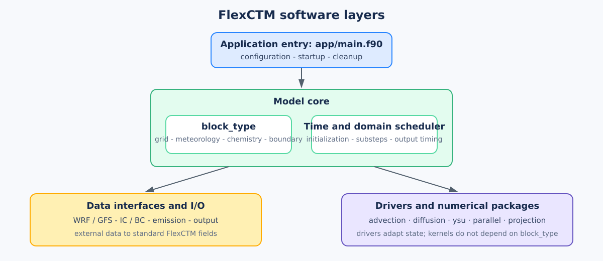
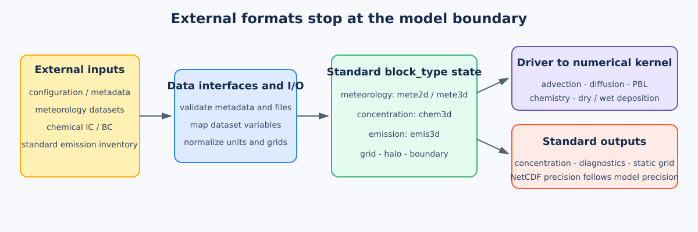
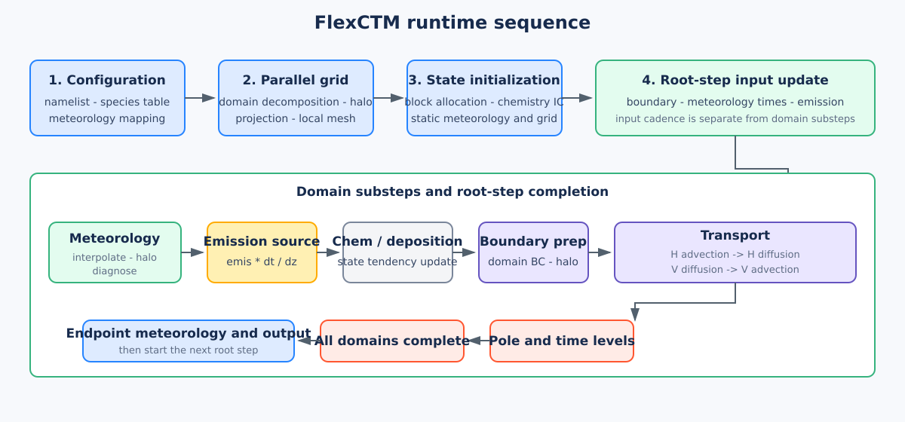

# 总体架构

FlexCTM 将外部数据、模式状态和数值算法分开。数据沿单一方向流动：

```text
配置与输入数据
        ↓
I/O 与数据集接口
        ↓
block_type 标准状态
        ↓
driver 与过程调度
        ↓
独立数值 kernel
```



## 1. 软件分层

| 层 | 主要代码 | 职责 |
|---|---|---|
| 应用编排 | `app/main.f90` | 初始化、domain 子步、过程顺序和输出时机 |
| 配置与元数据 | `mod_namelist`、`mod_chem_csv`、`mod_mete_csv` | 解析并验证文本配置 |
| 数据接口与 I/O | `mod_meteorology`、`mod_initial`、`mod_boundary`、`mod_emission`、`mod_output` | 外部文件与标准状态之间的转换 |
| 模式状态 | `block_type` | 保存一个 MPI rank 上一个 domain 的局地数据 |
| 过程适配 | `src/drive/` | 选取数组、处理 halo 和调用底层 kernel |
| 数值与基础包 | `advection`、`diffusion`、`ysu`、`parallel`、`projection` | 只实现明确的数值或基础能力 |

底层软件包不依赖 `block_type`、FlexCTM namelist 或 NetCDF 文件名。这条边界使同一数值算法可在其他模式和独立测试中复用。

## 2. 数据接口到数值算法



数据进入数值过程前经过三个明确阶段：

1. I/O 模块读取配置、气象数据、化学初边值和统一排放清单；
2. 数据集接口将 WRF、GFS 等外部变量转为 FlexCTM 的标准名称、单位和网格位置，写入 `block_type`；
3. driver 从 `block_type` 选取 kernel 需要的数组和标量，组织 halo、边界和结果回写。

因此，气象数据集可以更换，而平流、扩散和化学过程的输入契约保持不变。只有气象保留数据源分派；初值、边界和排放各使用一种统一文件格式。排放读取后进入 `emis3d`，文件缺失时使用确定性 MOCK 回退。

## 3. `block_type` 的位置

每个 MPI rank 为每个 domain 保有一个 `block_type`。它把网格、化学浓度、气象、排放和边界放在同一个生命周期中，便于 domain 分解和时间推进。

`block_type` 是主仓的组织对象，不是底层物理化学机制的公开接口。机制边界处由 driver 拆出所需字段，详见[数据结构](data-structures.html)和[接口规则](interfaces.html)。

## 4. 运行时序



初始化阶段依次读取配置和元数据、建立投影与 MPI 分解、分配 `block_type`、读取化学初值和静态气象场。

每个根 domain 时间步中，先按各自时间间隔准备边界、气象和排放，再按 domain 执行子步。一个子步内的逻辑顺序为：

```text
气象时间插值与诊断
  → 排放源项
  → 化学与沉降
  → domain 边界与 halo
  → 水平平流
  → 水平扩散
  → 垂直扩散
  → 垂直平流
  → 极区同步与时间层滑动
```

输入更新频率、domain 子步和输出时机是三个独立概念。运算顺序会改变数值结果，修改时必须有对应的数值测试。
